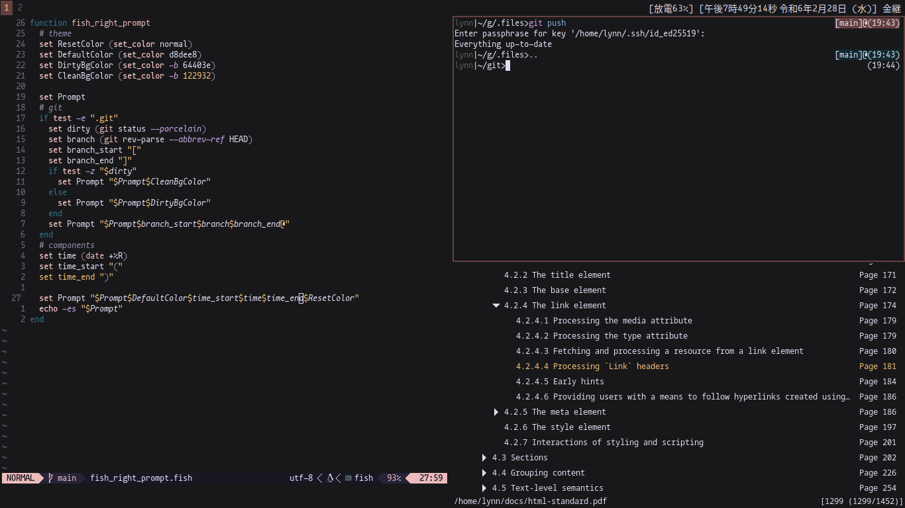

# My slowly organizing pile of shell scripts

## "Installing" it
`./install` will run a script to stow a few folders. you will still need to install any dependencies.
this is for a wayland, sway, alacritty, fish environment. sway and zathura themes are by myself,
and im slowly trying to port them to the rest of the applications. 

## Example

